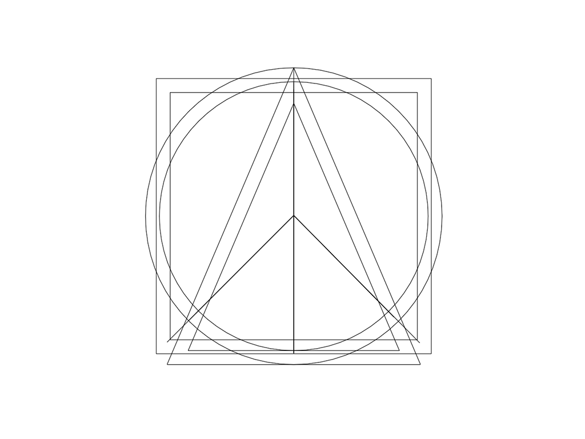
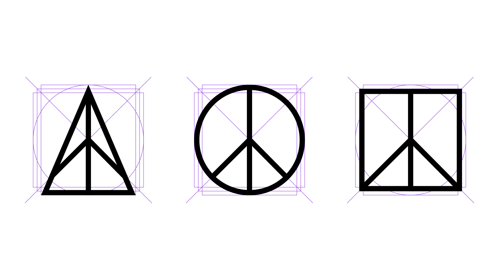
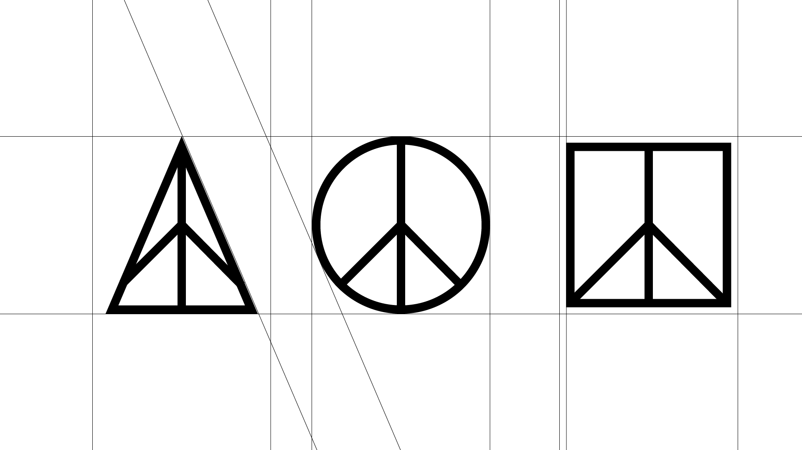
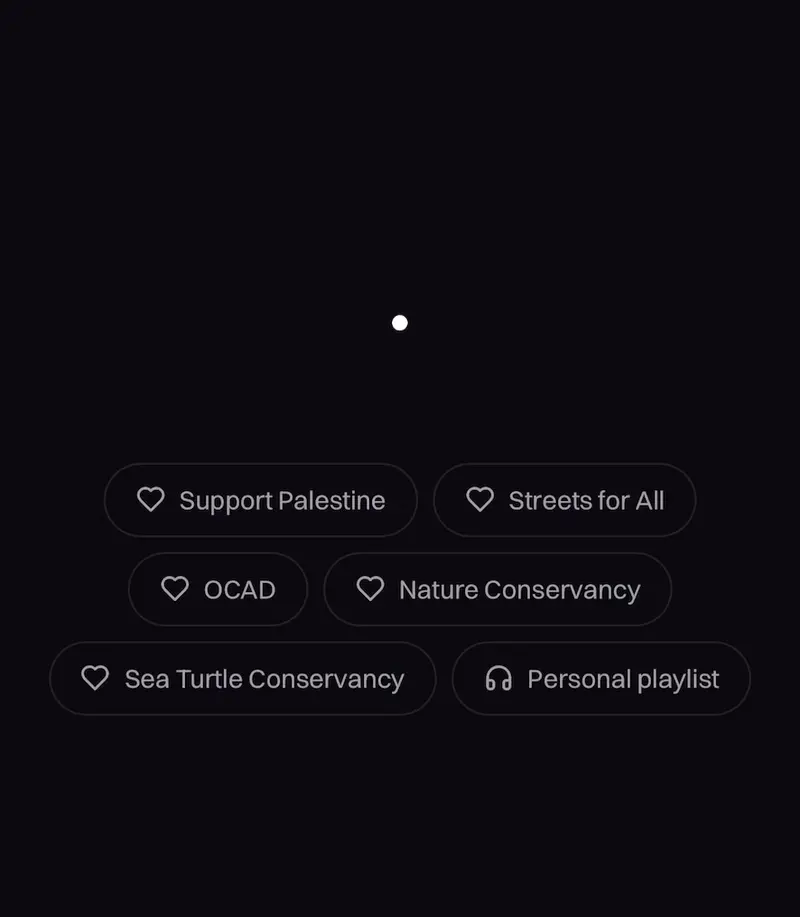
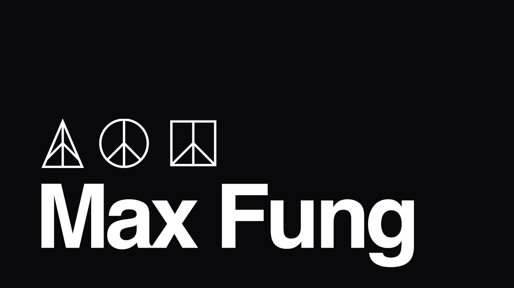

While designing this site, I knew I wanted a bold visual motif—something personally meaningful, graphically striking, and conceptually rich. It became a chance to reconnect with my design background and experiment with visual symbolism.

## The Inspiration

I’ve always been drawn to the peace symbol—its roots in the anti-war and countercultural movements of the 1960s and ’70s, and its original design by Gerald Holtom for the 1958 Campaign for Nuclear Disarmament. Built from the semaphore signals for “N” and “D,” it’s a piece of protest art that became universal. Over time, it’s come to represent a broader ethos: nonviolence, resistance, solidarity.

That’s what I love most about it—its clarity, its history, its adaptability. I’ve worn a peace sign necklace nearly every day for years as a quiet protest against global violence and injustice.

The idea to reimagine the peace symbol using geometric forms came partly from the _Outer Peace_ album cover by Toro y Moi, which features a square-framed version of the symbol. That detail stuck with me. Chaz Bear’s fusion of musical and visual creativity, his design sensibility, and his DIY approach to identity have influenced me for years.

## Motivations

Symbols are how we compress meaning into form. My goal was to take one of the most recognizable icons of the last century and reinterpret it—not to strip it of meaning, but to shift its context. Swapping the circle for a triangle or square anchors the image in a different visual tradition: elemental geometry. These three shapes—circle, triangle, square—form the basis of so much human thought, from architecture to spirituality. There’s something timeless and universal about them.

From one idea—the original peace symbol—two new ideas emerged: visibly connected, but uniquely reinterpreted. To me, this represents how ideas evolve as they propagate through human culture, subtly transformed by each new mind, like the distortion of a phrase in a game of telephone. The shapes may change, but the core—the three connected lines—remains constant.

## Design Theory

At one point, I considered adjusting the core’s position within the triangle. The thinness at the top made the center feel visually unbalanced. But after experimenting with different alignments, I decided against changing it. These symbols weren’t designed to be perfectly composed in isolation, but as part of a larger whole. Displayed together, it made sense to keep the cores identical—to reinforce continuity.

**Visual weight** refers to how “heavy” or prominent elements appear in a composition. Even if shapes are the same size, one may feel heavier due to color, thickness, or placement. **Optical balance** is how something feels to the eye—not how it measures on a grid.

In logo design, you must control where the eye goes first. Uneven visual weight can disrupt hierarchy, letting the container shape (triangle, square, etc.) overpower the symbol inside. Negative space becomes critical. Poor spacing creates tension and misalignment.

My original design had outline shapes of equal height and width. This made them feel off-balance when viewed together. I realized I needed to take inspiration from icon design and typography. Using reference templates for proper proportions, I recreated the forms with better attention to visual weight and optical balance.

I much preferred the results of this methodical approach. Once I was happy with the individual logos, it was time to place them in their final composition. I used a kerning-inspired method for spacing, measuring by eye at first.

To validate the spacing, I created a geometric trick: I drew two parallel lines—one along the triangle’s right edge, one along the circle’s left edge—then measured the orthogonal distance between them. That distance should match the space between the circle and the square.

To my surprise, my manual kerning matched the proportion exactly. That confirmation felt great. Applying these design principles elevated the idea into something elegant—and I’m really proud of it.

## Animation: Bringing It Together

While showing the designs to my girlfriend, I flipped through them rapidly to illustrate how the shapes morph around the core. We looked at each other and immediately thought: this should be animated.

The animation concept: the peace symbol appears from a single dot, expands outward, morphs across its variant shapes, spawning companions to the left and right, then merges back to complete the composition.

Animating this required interpolating between SVG paths of different shapes and point lengths. Thankfully, I found [Flubber](https://github.com/veltman/flubber), a JavaScript library for smooth path transitions, and paired it with [Motion](https://motion.dev), a lightweight animation library.

Initially, I hit performance issues. I’d exported logos from artboards over a thousand pixels wide, causing Flubber to choke. After hours of debugging, I realized the solution: convert the designs into compound paths, center them, and export from a 24×24 pixel artboard in Adobe Illustrator.

Each path is animated separately, grouped by region, and layered together using Motion. With spring-based easing functions, the result is smooth and organic. This animation now greets users on the homepage, introducing my brand and philosophy in a living, dynamic way.

## A Logo is Born

I call this piece _Harmony_. It reminds me of how musical notes come together to form something greater than any one note. In the same way, these forms—circle, triangle, square—combine to elevate the classic message of peace into something distinctively mine.

